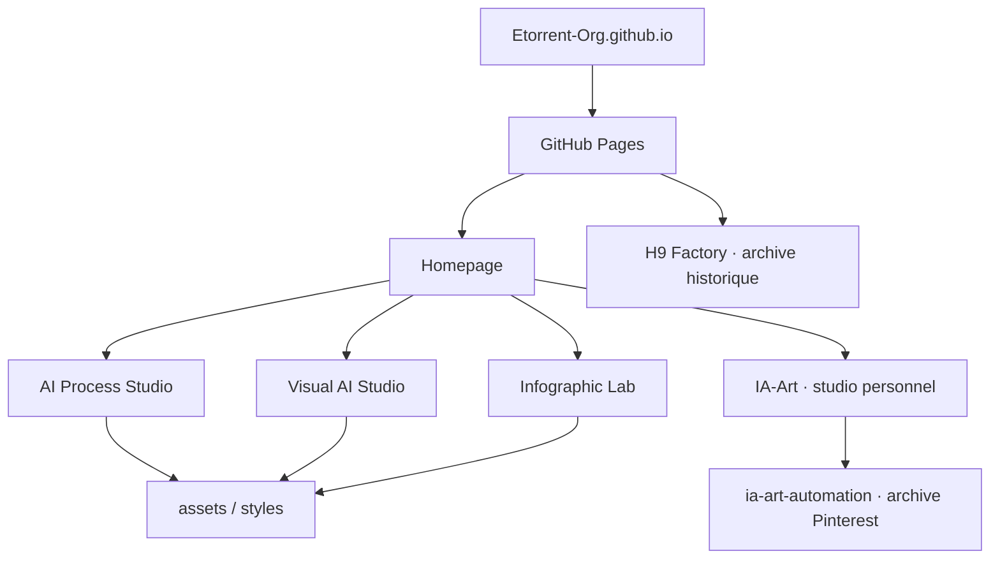

# Architecture

Le portail Etorrent-Org est un site statique publié avec GitHub Pages depuis `main`.

## Statut des pages

- `index.html` : portail courant ;
- `ai-process-studio/` : page produit AI Process Studio et conditions Professional ;
- `visual-ai-studio/` : page produit Visual AI Studio Web/Docker ;
- `infographic-lab/` : page produit Stable 1.0.0 + Augmented V2 ;
- IA-Art : présenté sur le portail comme studio personnel centré Instagram ; l'ancien site Pinterest reste conservé dans `Etorrent-Org/ia-art-automation` uniquement comme archive ;
- `h9-factory/` : ancienne page H9 conservée comme archive, non promue comme produit actif et retirée du sitemap courant.

## Principes

- aucun serveur applicatif ;
- aucune base de données ;
- aucun secret nécessaire au runtime ;
- pages HTML statiques ;
- styles et assets servis directement par GitHub Pages ;
- certaines images produit peuvent être chargées depuis les dépôts publics correspondants ;
- les pages historiques sont clairement séparées des produits actifs.

## Structure principale

- `index.html` : accueil et navigation ;
- `ai-process-studio/` : AI Process Studio ;
- `visual-ai-studio/` : Visual AI Studio ;
- `infographic-lab/` : Infographic Lab ;
- `h9-factory/` : archive H9 ;
- `assets/product-covers/` : couvertures des produits ;
- `assets/notion-hub/` : uniquement les assets encore nécessaires aux pages historiques/courantes ;
- `v2.css`, `v2-adjustments.css` : identité visuelle courante ;
- `sitemap.xml`, `robots.txt` : référencement ;
- `.nojekyll` : désactive le traitement Jekyll.

## Déploiement

La branche `main` est la source publiée. Après toute modification d'une page produit, vérifier également les métadonnées, liens, assets et la date `lastmod` correspondante dans `sitemap.xml`.
