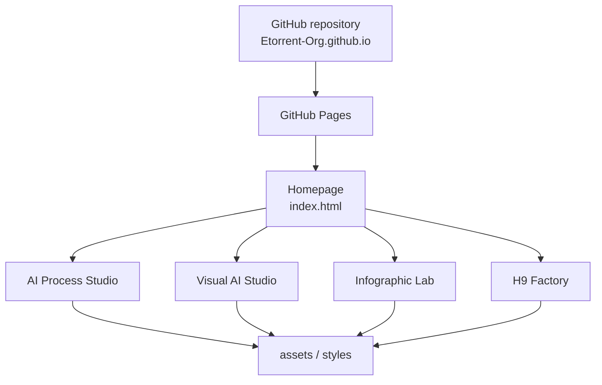

# Architecture

Le portail Etorrent-Org est un site statique publié avec GitHub Pages.

## Principes

- aucun serveur applicatif ;
- aucune base de données ;
- aucun secret nécessaire au runtime ;
- pages HTML statiques ;
- styles et assets servis directement par GitHub Pages ;
- certaines images produit peuvent être chargées depuis les dépôts publics correspondants.

## Structure principale

- `index.html` : accueil et navigation ;
- `ai-process-studio/` : AI Process Studio et conditions Professional ;
- `visual-ai-studio/` : Visual AI Studio ;
- `infographic-lab/` : Infographic Lab ;
- `h9-factory/` : H9 Factory ;
- `assets/` : ressources visuelles locales ;
- `styles.css`, `v2.css`, `v2-adjustments.css` : identité visuelle ;
- `sitemap.xml`, `robots.txt` : référencement ;
- `.nojekyll` : désactive le traitement Jekyll.

## Déploiement

La branche `main` est la source publiée. Une modification fusionnée dans `main` devient donc une modification du site public.
