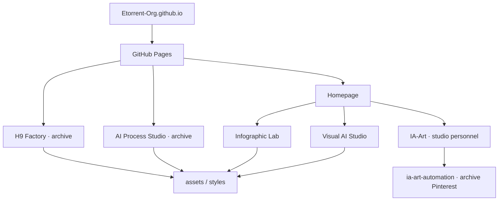

# Architecture

Le portail Etorrent-Org est un site statique publié avec GitHub Pages depuis `main`.

## Statut des pages

- `index.html` : portail courant ;
- `visual-ai-studio/` : produit public actif Visual AI Studio Web/Docker ;
- `infographic-lab/` : produit public actif, Stable 1.0.0 + Augmented V2 ;
- IA-Art : studio personnel centré Instagram, maintenu avec Visual AI Studio, Studio Visuel et le Skill IA-Art ;
- `ai-process-studio/` : archive de la dernière baseline 1.1.2, distribution et offre Professional retirées le 24 août 2026 ;
- `h9-factory/` : archive H9 ;
- `Etorrent-Org/ia-art-automation` : archive de l'ancien workflow Pinterest.

Les archives restent accessibles pour la traçabilité mais ne figurent plus dans le sitemap actif.

## Principes

- aucun serveur applicatif ;
- aucune base de données ;
- aucun secret nécessaire au runtime ;
- pages HTML statiques ;
- styles et assets servis directement par GitHub Pages ;
- certaines images produit peuvent être chargées depuis les dépôts publics correspondants ;
- séparation explicite entre produits actifs, studio personnel et archives.

## Structure principale

- `index.html` : accueil et navigation ;
- `visual-ai-studio/` : Visual AI Studio ;
- `infographic-lab/` : Infographic Lab ;
- `ai-process-studio/` : archive AI Process Studio et anciennes conditions Professional ;
- `h9-factory/` : archive H9 ;
- `assets/product-covers/` : couvertures des produits et archives présentées ;
- `assets/notion-hub/` : assets encore nécessaires aux pages historiques/courantes ;
- `v2.css`, `v2-adjustments.css` : identité visuelle courante ;
- `sitemap.xml`, `robots.txt` : référencement des pages actives ;
- `.nojekyll` : publication statique sans traitement Jekyll.

## Déploiement

La branche `main` est la source publiée. Après toute modification d'une page active, vérifier les métadonnées, liens, assets et la date `lastmod` correspondante dans `sitemap.xml`.
